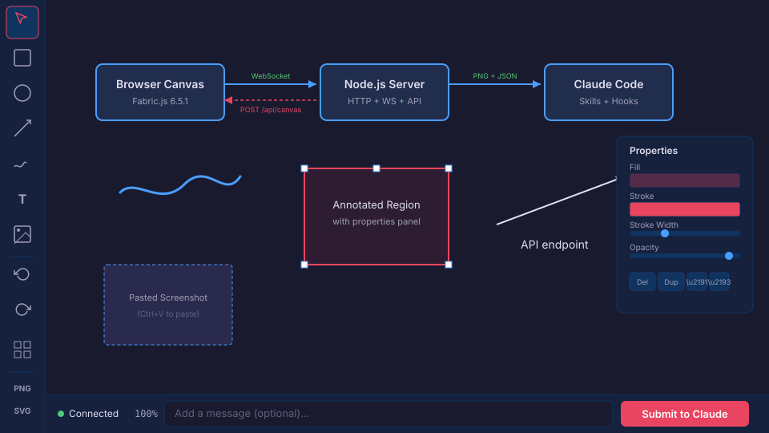

# Cavepaintings

> **Experimental** -- This project is in active development and should be considered in public testing. APIs, features, and behavior may change between releases. Feedback and bug reports are welcome via [GitHub Issues](https://github.com/RCellar/cavepaintings/issues).

A browser-based interactive drawing canvas that integrates with Claude Code. Draw diagrams, paste and annotate images, and submit canvas snapshots directly into your Claude Code conversation over a persistent WebSocket connection.



*Dark-themed canvas with left toolbar, floating properties panel, zoom indicator, and submit bar. The architecture diagram shows the bidirectional data flow -- submissions go from canvas to Claude, and the push API sends objects back.*

## Features

### Drawing Tools
- **Shapes** -- rectangles (R), ellipses (E), arrows (A), lines (L), polygons (P)
- **Freehand draw** (D) -- pencil brush with customizable color and width
- **Text** (T) -- click to place, double-click to edit inline
- **Image** (I) -- file picker, clipboard paste (Ctrl+V), drag-drop, or paste a URL
- **Connectors** (C) -- lines that attach to object anchor points and follow when objects move, with automatic routing around obstacles

### Canvas Management
- **Object list panel** (O) -- see all objects, click to select, drag to reorder z-index, double-click to rename, keyboard navigation
- **Properties panel** (Q) -- fill, stroke, opacity, font size, z-ordering; always visible with an empty-state prompt when nothing is selected
- **Snap-to-grid** (G) -- toggle a dot grid; objects snap to 24px increments when moved
- **Zoom & pan** -- scroll wheel to zoom (0.1x--10x), Alt+drag or middle-click to pan, zoom indicator with click-to-reset
- **Undo/redo** -- 50-state stack with Ctrl+Z / Ctrl+Y
- **Copy/paste** -- Ctrl+C / Ctrl+V to duplicate objects (multi-select supported)

### Export & Persistence
- **Export** -- PNG (2x HiDPI), SVG, and JSON
- **Import** -- JSON re-import to restore diagrams
- **Auto-save** -- canvas state persists in localStorage across browser refreshes
- **Dark/Light theme** -- toggle between themes, persists across sessions

### Claude Code Integration
- **Submit to Claude** -- sends 2x HiDPI PNG + Fabric.js JSON + optional message over WebSocket; Ctrl+Enter shortcut from the prompt field
- **Automatic notifications** -- a UserPromptSubmit hook detects new submissions and injects them into Claude's context with prompt text and object summaries
- **Canvas push API** -- Claude can programmatically place objects on the canvas via `POST /api/canvas`
- **Submissions API** -- harness-agnostic `GET /api/submissions?since=<timestamp>` endpoint for polling
- **Connection status** -- green/red indicator with automatic reconnect (exponential backoff)

### Responsive & Touch
- **Tablet layout** -- at viewport widths below 768px, the toolbar moves to a horizontal top bar with 44px touch targets, and panels become bottom sheets
- **Touch gestures** -- pinch to zoom, two-finger drag to pan, long-press for context menu, double-tap to edit text

### Security
- **HTTP security headers** -- Content-Security-Policy, X-Content-Type-Options, X-Frame-Options, Referrer-Policy on all responses
- **Input validation** -- schema validation on POST /api/canvas with 5 MB body limit
- **WebSocket origin checking** -- accepts only localhost origins, blocks cross-site hijacking
- **File permissions** -- submissions and state files written with restrictive permissions (0700 dirs, 0600 files)
- **Rate limiting** -- sliding window limits on all API endpoints and WebSocket messages
- **Path traversal protection** -- static file server validates against traversal attacks

### Accessibility
- aria-labels on all controls with keyboard shortcut hints
- aria-pressed states on toggle buttons
- Label associations on all inputs
- Keyboard navigation in object list panel (arrow keys, Alt+Arrow to reorder, Delete to remove)
- Toast notifications use `role="alert"` for screen reader announcements

## Quick Start

Cavepaintings is designed to be installed as a Claude Code plugin. Once installed, use `/cavepaintings` and `/cavepaintings-stop` inside any Claude Code session -- no manual server management needed.

**Prerequisites:** [Node.js](https://nodejs.org/) (v18+) and npm. Dependencies install automatically on first launch.

### 1. Register the marketplace

Add to your Claude Code settings (`~/.claude/settings.json`):

```json
{
  "extraKnownMarketplaces": {
    "cavepaintings-marketplace": {
      "repo": "RCellar/cavepaintings",
      "branch": "master"
    }
  }
}
```

Or ask Claude Code: *"Add `RCellar/cavepaintings` as a custom marketplace called `cavepaintings-marketplace`"*

### 2. Install the plugin

In Claude Code, run `/plugins`, navigate to **Discover**, find `cavepaintings`, and install it.

### 3. Use it

```
/cavepaintings          # opens the canvas in your browser
/cavepaintings-stop     # stops the server
```

Draw something, click **Submit to Claude** (or Ctrl+Enter), then send any message in Claude Code. The plugin automatically injects your canvas submission into the conversation.

## Usage Guide

### Drawing Shapes

Select a shape tool from the toolbar (or press its shortcut key), then click and drag on the canvas to draw. Release the mouse to finalize the shape. Zero-size shapes (click without drag) are automatically discarded.

- **Rectangle (R)** -- drag to set width and height; handles negative drag directions
- **Ellipse (E)** -- drag to set radii
- **Arrow (A)** -- drag from start to end; renders as a line with arrowhead
- **Line (L)** -- drag from start to end; plain line without arrowhead

### Drawing Polygons

Press **P** to activate the polygon tool, then click to place vertices one at a time. A dashed preview shows the shape as you go. To close the polygon:
- Click near the first vertex (within 10px), or
- Double-click anywhere

Press **Escape** to cancel mid-draw. Polygons require at least 3 vertices.

### Using Connectors

Press **C** to activate the connector tool. Anchor points appear as small circles at the edges of each object (top, right, bottom, left).

1. Click an anchor point on any object to start the connection
2. Move to another object -- anchors highlight when you're close enough to snap
3. Click an anchor point on a different object to create the connector

Connectors automatically:
- Follow when either connected object is moved, resized, or rotated
- Route around obstacles when a straight path would cross through other objects
- Get deleted when a connected object is removed

Press **Escape** or click empty canvas to cancel. You cannot connect an object to itself.

### Managing Objects

Press **O** to open the object list panel. It shows every canvas object ordered by z-index (top of stack first).

- **Click** an item to select it on the canvas (pans to center if off-screen)
- **Ctrl+Click** for multi-select
- **Drag** items to reorder z-index (or use **Alt+Up/Down** on keyboard)
- **Double-click** a label to rename the object
- Click the **x** button to delete

Connectors display as "Connector: Source -> Target" using object names.

### Properties Panel

The properties panel (right side) shows controls for the selected object: fill color, stroke color, stroke width, font size, opacity, and z-order buttons (Del, Dup, Up, Down).

When nothing is selected, it shows "Select an object to edit properties." Press **Q** to toggle the panel. On first use, a brief hint arrow points to the panel.

### Adding Images

Several ways to add images:
- Press **I** and pick a file
- **Drag and drop** an image file onto the canvas
- **Ctrl+V** to paste an image from your clipboard
- **Paste a URL** -- paste text matching an image URL (`.png`, `.jpg`, `.gif`, `.webp`, `.svg`) and the image loads automatically
- Use the **Image URL** input field (appears when image tool is active) for any URL

### Submitting to Claude

1. Draw or paste content on the canvas
2. Optionally type a message in the prompt field at the bottom
3. Click **Submit to Claude** or press **Ctrl+Enter**
4. The button shows "Sending..." then "Sent!" on confirmation
5. In Claude Code, type anything -- the hook automatically injects the submission

Claude receives both a visual PNG (for understanding the image) and the full Fabric.js JSON (for programmatic reasoning about individual objects).

### Claude Drawing on the Canvas

Claude can push objects directly to your canvas:

```bash
curl -s -X POST http://localhost:9731/api/canvas \
  -H 'Content-Type: application/json' \
  -d '{"diagram":{"objects":[
    {"type":"rect","left":50,"top":50,"width":200,"height":100,"fill":"#4a9eff","stroke":"#fff","strokeWidth":2},
    {"type":"i-text","left":70,"top":80,"text":"Hello from Claude","fill":"#fff","fontSize":16}
  ]},"mode":"merge"}'
```

Use `"mode": "merge"` to add to the canvas or `"mode": "replace"` to clear and load fresh.

## Keyboard Shortcuts

| Key | Action |
|-----|--------|
| V | Select tool |
| R | Rectangle tool |
| E | Ellipse tool |
| A | Arrow tool |
| L | Line tool |
| P | Polygon tool |
| D | Freehand draw |
| T | Text tool |
| I | Image (file picker) |
| C | Connector tool |
| G | Toggle grid |
| O | Toggle object list panel |
| Q | Toggle properties panel |
| Escape | Cancel polygon / connector drawing |
| Ctrl+C | Copy selected object(s) |
| Ctrl+V | Paste copied object(s) or image |
| Ctrl+Z | Undo |
| Ctrl+Y | Redo |
| Ctrl+Enter | Submit to Claude (when prompt field focused) |
| Delete | Remove selected object(s) |
| Alt+Drag | Pan canvas |
| Scroll wheel | Zoom in/out (centered on cursor) |

### Touch Gestures (Tablet)

| Gesture | Action |
|---------|--------|
| Single finger drag | Active tool action |
| Pinch | Zoom |
| Two-finger drag | Pan |
| Long press (500ms) | Context menu |
| Double tap | Edit text / close polygon |

## Alternative Install Methods

The recommended install path is the marketplace plugin described in [Quick Start](#quick-start). These alternatives are available for specific workflows.

### Project-level skills

If you only need the canvas in projects where cavepaintings is cloned, no plugin setup is needed. Clone the repo into your working directory and Claude Code discovers the `skills/` folder automatically.

### Manual skill symlink

Symlink the skill directories into any project with a `skills/` directory:

```bash
ln -s /path/to/cavepaintings/skills/cavepaintings /your/project/skills/cavepaintings
ln -s /path/to/cavepaintings/skills/cavepaintings-stop /your/project/skills/cavepaintings-stop
```

### Standalone (without Claude Code)

For use outside Claude Code, run the server directly:

```bash
git clone https://github.com/RCellar/cavepaintings.git
cd cavepaintings
npm install
node server.js
```

The browser opens automatically. CLI options: `--port 8080` for a custom port, `--no-open` to skip the browser. The server tries the next port automatically if the default (9731) is in use.

## Architecture

```
                    WebSocket (submit)
Browser Canvas  ─────────────────────────►  Node.js Server  ──files──►  Claude Code
  (Fabric.js)   ◄─────────────────────────   (http + ws)               (skills + hooks)
                    WebSocket (load)          REST API
                                            /api/canvas
                                            /api/submissions
                                            /api/info
```

### Client Modules

The client is split into focused ES modules:

| Module | Responsibility |
|--------|---------------|
| `app.js` | Entry point -- imports and wires all modules on DOMContentLoaded |
| `canvas-core.js` | Canvas init, shared state, undo/redo, grid, theme, auto-save, resize, zoom |
| `tools.js` | Tool switching, shape drawing, toolbar wiring, keyboard shortcuts |
| `connectors.js` | Connector system -- anchor points, routing algorithm, lifecycle, serialization |
| `object-list.js` | Object list panel -- selection sync, drag reorder, rename, keyboard nav |
| `properties.js` | Properties panel -- updates, discoverability, brush panel |
| `websocket-client.js` | WebSocket connection, reconnect, message handling, submit to Claude |
| `image-utils.js` | Image paste, drag-drop, URL loading |
| `touch.js` | Touch gesture recognition -- pinch, pan, long-press, double-tap |

### Server

- `server.js` -- HTTP static file server + WebSocket + REST API with security hardening (headers, validation, origin checks, rate limiting, file permissions)

### Supporting Files

- `vendor/fabric.min.js` -- locally bundled Fabric.js 6.5.1 (no CDN, works offline)
- `skills/` -- Claude Code skill definitions (start/stop)
- `hooks/` -- UserPromptSubmit hook with multi-submission tracking, SessionStart hook for dependency install
- `.claude-plugin/` -- plugin metadata for marketplace installation

## API

Cavepaintings exposes a REST API and WebSocket protocol for programmatic canvas interaction. See **[API.md](API.md)** for the full reference, including:

- **GET /api/info** -- project directory name
- **GET /api/submissions?since=\<timestamp\>** -- poll for canvas submissions
- **POST /api/canvas** -- push Fabric.js objects to the canvas in real time
- **WebSocket protocol** -- submit/ack/load/displaced message types
- **Security** -- headers, origin validation, rate limits
- **CLI options** -- `--port`, `--max-submissions`, `--owner-pid`

## Running Tests

```bash
npm test                    # 39 node:test tests (server, API, security, lifecycle, submissions)
npx playwright test         # 41 Playwright browser tests (tools, connectors, object list, responsive, a11y)
```

## Updating

After making changes to the plugin:

```bash
npm run release 0.3.0    # bumps version, commits, pushes, cleans old cache versions
```

Then in Claude Code:

```
/plugin update cavepaintings@cavepaintings-marketplace
/reload-plugins
```

Dependencies are installed automatically on session start via a `SessionStart` hook, so users never need to run `npm install` manually.

## Tech Stack

- [Fabric.js](http://fabricjs.com/) 6.5.1 (bundled locally, no CDN dependency)
- Node.js with `http` and `ws` modules
- Vanilla HTML/CSS/JS (ES modules) -- no framework, no bundler

## License

MIT
